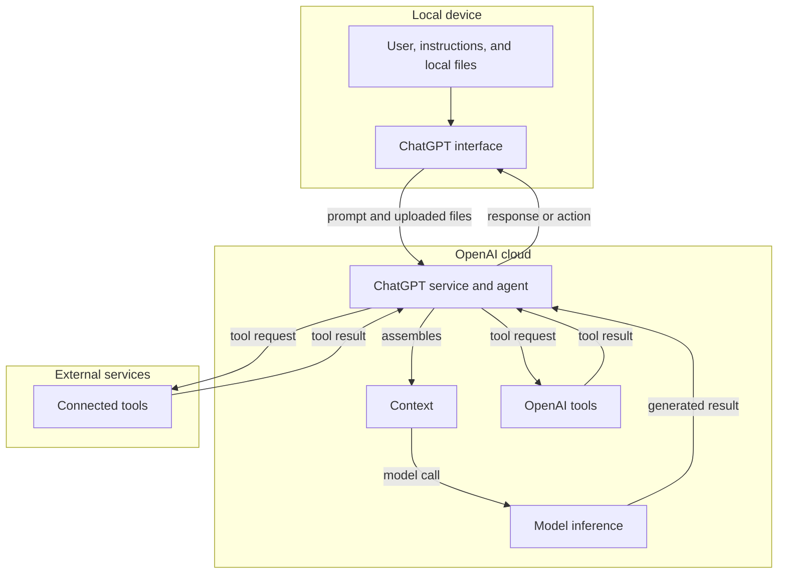

# Practical AI

Definition of
[artificial intelligence](https://en.wikipedia.org/wiki/Artificial_intelligence)
has evolved over time. In the 1950s, we wanted computers to read and reason.
It was all about
[symbolic computation](https://en.wikipedia.org/wiki/Symbolic_computation) and
[natural language processing](https://en.wikipedia.org/wiki/Natural_language_processing),
hence [Lisp](<https://en.wikipedia.org/wiki/Lisp_(programming_language)>).
Then we wanted computers to see, so the focus shifted to
[computer vision](https://en.wikipedia.org/wiki/Computer_vision) and
[machine learning](https://en.wikipedia.org/wiki/Machine_learning).
Today [large language models](https://en.wikipedia.org/wiki/Large_language_model)
(LLMs) dominate the public discourse.

[Generative AI](https://en.wikipedia.org/wiki/Generative_artificial_intelligence)
creates text, images, audio, video, or other content.
An LLM is a generative model trained to process and produce language. Modern
[multimodal models](https://en.wikipedia.org/wiki/Multimodal_learning) can work
with text, images, and audio, but their
exact capabilities heavily depend on the model.

## Generative AI

Common uses include:

- Drafting, rewriting, and
  [summarizing text](https://en.wikipedia.org/wiki/Automatic_summarization)
- [Extracting](https://en.wikipedia.org/wiki/Information_extraction) and
  [classifying](https://en.wikipedia.org/wiki/Text_classification) information
- Producing first-pass explanations
- [Translating](https://en.wikipedia.org/wiki/Machine_translation) between
  natural languages
- [Converting structured data](https://en.wikipedia.org/wiki/Data_conversion)
  between formats
- Brainstorming alternatives
- [Writing](https://en.wikipedia.org/wiki/Automatic_programming) and
  [reviewing](https://en.wikipedia.org/wiki/Code_review) code
- Creating and editing
  [images](https://en.wikipedia.org/wiki/Text-to-image_model),
  [audio](https://en.wikipedia.org/wiki/Generative_audio), and
  [video](https://en.wikipedia.org/wiki/Text-to-video_model)

### The Good

Use AI to accelerate work and judgment, not replace them. Verify factual claims,
inspect primary sources, test generated code, and apply more scrutiny to
consequential decisions involving health, finances, legal rights, or security.

### The Ugly

Generative AI produces plausible output, not guaranteed truth. An answer may be

- incomplete,
- outdated, or
- incorrect.

It can confidently invent facts, citations,
or reasoning. This is often called an
[AI hallucination](<https://en.wikipedia.org/wiki/Hallucination_(artificial_intelligence)>),
while the
[NIST Generative AI Profile](https://doi.org/10.6028/NIST.AI.600-1) uses the term
*confabulation*.

## Models, Context, Tools, and Agents

Consider a simple chat with ChatGPT in a browser.

A [large language model](https://en.wikipedia.org/wiki/Large_language_model)
generates each response from its context. The application assembles that context
from:

- System and user instructions
- Previous messages
- Uploaded or retrieved files, e.g. images, audio, and other supported inputs
- Available tools and their results

A [tool](https://en.wikipedia.org/wiki/Large_language_model#Tool_use) provides the
[model](https://en.wikipedia.org/wiki/Machine_learning#Models)
with access, e.g. web and file search, database queries, code execution. A tool definition tells the model how to request that
capability. The application runs the tool and returns its result to the model.

Context is limited by the model's
[context window](https://en.wikipedia.org/wiki/Context_window). Long
conversations may be truncated or summarized. More context is not always
better: irrelevant or contradictory information can degrade the result.

Give the model a clear goal, relevant background, constraints, and the desired
output format. Keep durable information in files instead of relying on chat
history.

For larger tasks, point the application to a specific directory and explain how
to retrieve information.

An [agent](https://en.wikipedia.org/wiki/AI_agent) combines a model with tools
and an execution loop so it can plan, act, inspect results, and continue toward
a goal. Repeated workflows can be captured as skills.

In this ChatGPT example, the interface and source files begin on the local
device. Prompts and uploaded files are sent to the OpenAI cloud, where ChatGPT
assembles context and runs model inference. Connected tools may be hosted by
OpenAI or by external services.

## File Formats

Favored are formats that make structure explicit and easy to inspect:

- [Markdown](https://en.wikipedia.org/wiki/Markdown) for prose and instructions
- [JSON](https://en.wikipedia.org/wiki/JSON) for structured data exchanged with
  software
- [YAML](https://en.wikipedia.org/wiki/YAML) or
  [TOML](https://en.wikipedia.org/wiki/TOML) for structured configuration
  intended for people to edit
- [CSV](https://en.wikipedia.org/wiki/Comma-separated_values) or
  [TSV](https://en.wikipedia.org/wiki/Tab-separated_values) for simple tables

PDF and DOCX are useful for preserving document presentation, but conversion to
text can lose layout and relationships. Check extracted content before relying
on a model's interpretation.

## Example: Trip Planning

To plan my trips I created a [trip-planning](https://github.com/asokolsky/travels) repo:

- [`AGENTS.md`](https://github.com/asokolsky/travels/blob/main/AGENTS.md) is a
  Markdown file containing repo-wide instructions, priorities, and
  verification rules.
- [`<trip>/index.md`](https://github.com/asokolsky/travels/blob/main/balkans-2026/index.md)
  is the trip's Markdown itinerary created by ChatGPT. It contains YAML
  frontmatter, assumptions, the route, daily plans, confirmed reservations, and
  links to sources.
- [`<trip>/<trip>-stops.geojson`](https://github.com/asokolsky/travels/blob/main/balkans-2026/balkans-2026-stops.geojson)
  contains this trip's map in
  [GeoJSON](https://en.wikipedia.org/wiki/GeoJSON) format.

The agent retrieves relevant content from these files for the model's context.
The model compares options and drafts changes. File-search tools retrieve saved
facts; web-search tools verify current schedules, opening hours, border rules,
and prices. The agent then updates the itinerary and GeoJSON together. A map
builder may generate an HTML map from the GeoJSON; generated HTML is output, not
the source of truth.

[GitHub Pages](https://pages.github.com/) publishes the
[rendered itinerary and generated map](https://asokolsky.github.io/travels/balkans-2026/).

## Skills

An [agent skill](https://agentskills.io/) packages instructions, resources, and
optional scripts for a reusable workflow. The
[spec](https://agentskills.io/specification) defines the format, centered on a
`SKILL.md` file. It was
[published on December 18, 2025](https://www.anthropic.com/engineering/equipping-agents-for-the-real-world-with-agent-skills)
and is widely adopted.

A skill describes *how* to perform a task; a tool provides a capability such as
web search or file access. An agent can select a skill based on the task, or the
user can invoke it explicitly. See the
[OpenAI skills guide](https://learn.chatgpt.com/docs/build-skills) for one
implementation.

The travel repo's
[`static-marker-map` skill](https://github.com/asokolsky/travels/blob/main/skills/static-marker-map/SKILL.md)
uses a Python script to generate and verify a Leaflet HTML map from GeoJSON.

## Cloud-Hosted vs. Local Models

Models from [frontier labs](https://www.longtermwiki.com/wiki/E820), such as
[OpenAI](https://openai.com/) and [Anthropic](https://www.anthropic.com/), are
commonly accessed through hosted products or APIs.
[Inference](https://en.wikipedia.org/wiki/Inference) then occurs on the
provider's infrastructure. Hosted models usually require little setup and offer
strong capabilities, but data leaves the device and use may incur recurring
costs.

Local models run on hardware under the user's control. They can work offline and
offer more direct control over data, but require suitable hardware, storage,
configuration, and maintenance. They are not automatically private: the
surrounding application may still use telemetry, web search, hosted embeddings,
or other network services.

For hosted services, review the exact product's training, retention, residency,
and deletion policies rather than assuming that all services behave alike. For
example, OpenAI documents separate
[business-data commitments](https://openai.com/business-data/) and
[API data controls](https://platform.openai.com/docs/guides/your-data).

## Practical Checklist

Before using AI for a task:

1. Define the desired result and the cost of a wrong answer.
1. Choose what data the system may receive.
1. Provide only relevant context and explicit constraints.
1. Decide whether the model needs tools or current information.
1. Request an output format that is easy to inspect or test.
1. Verify important claims and actions independently.
1. Save durable decisions and evidence outside the chat.
