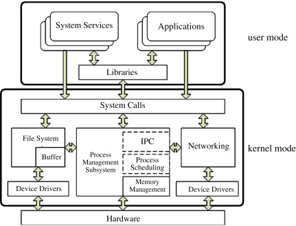

# Computing

Why relevant:

* ubiquity
* it is cool to know it

More computing:

* [Skills](./skills.md)
* [Tasks](./tasks.md)

## Architecture

Computers have:

* CPUs with multiple cores, executing multiple threads
* RAM
* Persistent storage

Here are few examples (order of magnitude):

Computer|Power Consumption (W)
--------|---------------------
server in a data center|1000
gaming laptop|100
home router|10
access point|10
tablet|10
smart phone|1-10
smart watch|1
climate controller|0.1
smart lock|0.1

Check-up: what does "order of magnitude" mean?

Check-up: justify (not) buying a new laptop for green purposes.

## Buses

[Bus](https://en.wikipedia.org/wiki/Bus_(computing)) is used to connect computing pieces together, can be serial or parallel.

* [PCI Express](https://en.wikipedia.org/wiki/PCI_Express)
* [I2C](https://en.wikipedia.org/wiki/I%C2%B2C)
* [USB](https://en.wikipedia.org/wiki/USB)
* [thunderbolt](https://en.wikipedia.org/wiki/Thunderbolt_(interface))
* [HDMI](https://en.wikipedia.org/wiki/HDMI)

Check-up: how is the webcam in your laptop connected to the laptop?

Check-up: is USB serial or parallel bus?  HDMI?

## Operating System

[Operating system](https://en.wikipedia.org/wiki/Operating_system) differentiates a true computer and a controller. We focus on the former unless specified otherwise.

Example OSs:

* [OS/360](https://en.wikipedia.org/wiki/OS/360_and_successors)
* [Windows 11](https://en.wikipedia.org/wiki/Windows_11)
* [MacOS 14 Sonoma](https://en.wikipedia.org/wiki/MacOS_Sonoma)
* [Ubuntu 24.04 LTS](https://en.wikipedia.org/wiki/Ubuntu_version_history#2404)

(Engineering) Mind-share leader: Linux family of OSes.

Trends:

* commoditization
* immutability
* move to cloud

### OS Architecture

## Graphical User Interface

[GUI](https://en.wikipedia.org/wiki/Graphical_user_interface) terminology:

* cursor vs caret
* icon
* window
* title bar
* scrollbar
* status bar
* menubar
* pull down menu
* Popup menu
* dialog box, app/system modal
* pop up

Widgets / controls:

* check box
* radio box
* group box
* tabbed dialog
* button
* tooltip

The above terminology is fully applicable to both native and web applications.

More in depth: [Sus Lundgren. What makes a GUI good?](https://studylib.net/doc/5460687/)

Check-up: give example how cursor is used to communicate pliancy.

Trends:

* affected by web
* support for tiling

There exist(ed) OSes without GUI:

* [MS-DOS](https://en.wikipedia.org/wiki/MS-DOS) - old enough to be before GUI
* [Ubuntu Server](https://ubuntu.com/server/docs) - new but still lacks GUI to
preserve resources.
* [Amazon Bottlerocket](https://aws.amazon.com/bottlerocket/)

We will NOT be talking about GUI anymore.  Why to NOT use GUI:

* you can reach higher productivity
* your actions can be better automated
* computing resources in the cloud and IoT may not have GUI.

## Want to look cool? Use keyboard!  Even with GUI

* [Mac keyboard shortcuts](https://support.apple.com/en-us/HT201236)
* [Windows keyboard shortcuts](https://support.microsoft.com/en-us/windows/windows-keyboard-shortcuts-3d444b08-3a00-abd6-67da-ecfc07e86b98)
* oldie but still works: [IBM CUA](https://en.wikipedia.org/wiki/IBM_Common_User_Access)

## OS Concepts: Processes

Process is NOT a window.

Each [process](https://en.wikipedia.org/wiki/Process_(computing)) has:

* an ID
* parent, and (maybe) children
* state
* command line
* environment
* cwd
* threads

Benefits:

* compartmentalization
* (mutual) protection

Process states:

Note: major engineering concept: [state machine](https://en.wikipedia.org/wiki/Finite-state_machine).

Process memory map:

## OS Concepts: File System

Commonly used:

* [Apple File System](https://en.wikipedia.org/wiki/Apple_File_System) -
default choice in MacOS
* [ntfs](https://en.wikipedia.org/wiki/NTFS)
* [ext4](https://en.wikipedia.org/wiki/Ext4) - default choice in Linux
* [zfs](https://en.wikipedia.org/wiki/ZFS) - best choice for
[network-attached storage](https://en.wikipedia.org/wiki/Network-attached_storage)
* [fat32](https://en.wikipedia.org/wiki/File_Allocation_Table#FAT32), better yet
[exFAT](https://en.wikipedia.org/wiki/ExFAT) - good choice when you want for
your USB drive to be portable across all the computing devices.

### Linux File Permissions

[Linux file permissions explained](https://www.redhat.com/sysadmin/linux-file-permissions-explained)

### Linux File System Hierarchy

[Filesystem Hierarchy Standard](https://refspecs.linuxfoundation.org/FHS_3.0/fhs/index.html)

## Command Line, Shell and Text Processing

[Command Line Interface](https://en.wikipedia.org/wiki/Command-line_interface)

Why use command line:

* efficient use of computer resources
* (much higher) productivity
* allows for custom scripts/actions

[Command Line Interpreters](https://en.wikipedia.org/wiki/List_of_command-line_interpreters)

[zsh](https://en.wikipedia.org/wiki/Z_shell) made to all the operating systems:

* native on MacOS and Linux
* [can be installed](https://dev.to/equiman/zsh-on-windows-without-wsl-4ah9) on Windows.

### Command Line Use Examples

* Editors, e.g. [vi](https://asokolsky.github.io/apps/vi.html), `nano`, [emacs](https://asokolsky.github.io/apps/emacs/)
* [make and Makefile](https://asokolsky.github.io/apps/make/)

## File Formats

Binary vs text-based:

Binary|Text
------|----
Unreadable by human|Readable
Used for data such as audio, video, executables|Used for configuration, data, etc.

* [List of file formats](https://en.wikipedia.org/wiki/List_of_file_formats)
* [Text-based formats](https://en.wikipedia.org/wiki/List_of_file_formats#Text-based)
include [document markup](https://en.wikipedia.org/wiki/List_of_document_markup_languages)
formats, including most important ones
[HTML](https://en.wikipedia.org/wiki/HTML) and
[markdown](https://en.wikipedia.org/wiki/Markdown).

Audio: wav, mp3

Video: mjpg, mkv

File formats are subject to fashion:

* out: xml
* in: yaml, json
* timeless: csv

## More Reading

[Programming](Programming/)

Elsewhere:

* More in depth: [Linux SysOps Handbook](https://github.com/abarrak/linux-sysops-handbook/)

Continue to [Cryptography](../Cryptography/)
